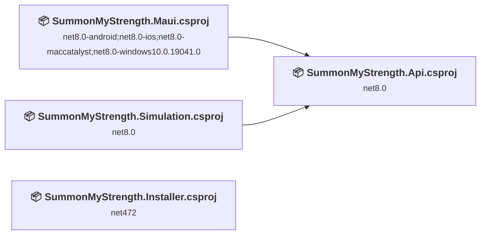
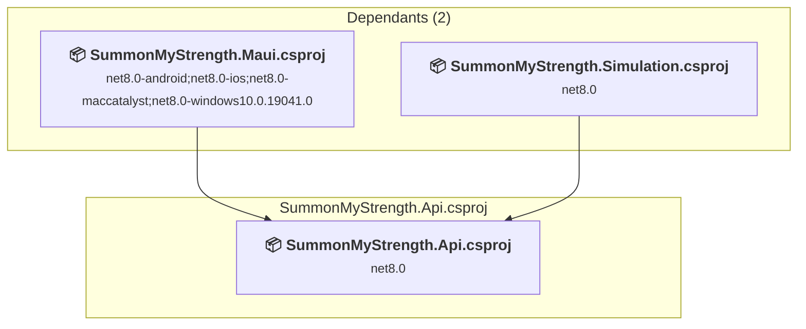
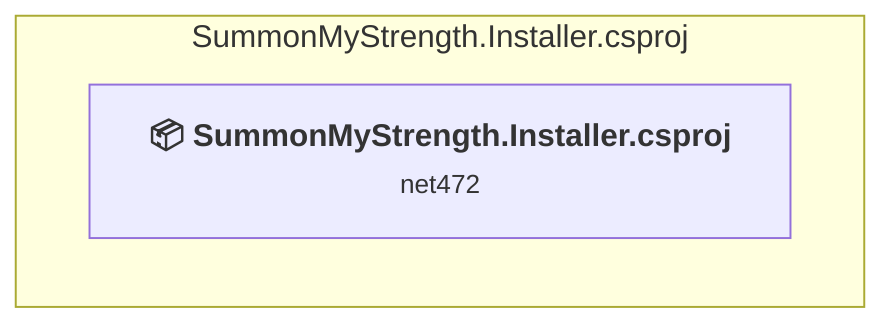
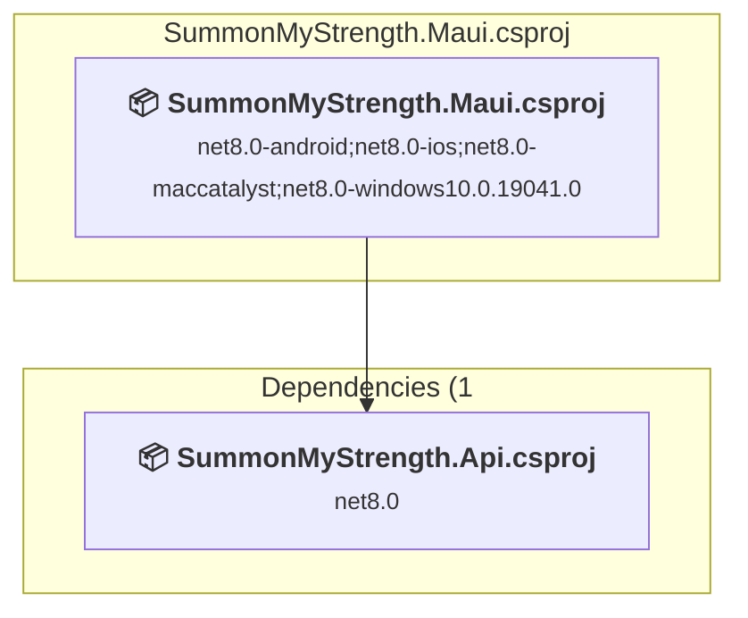
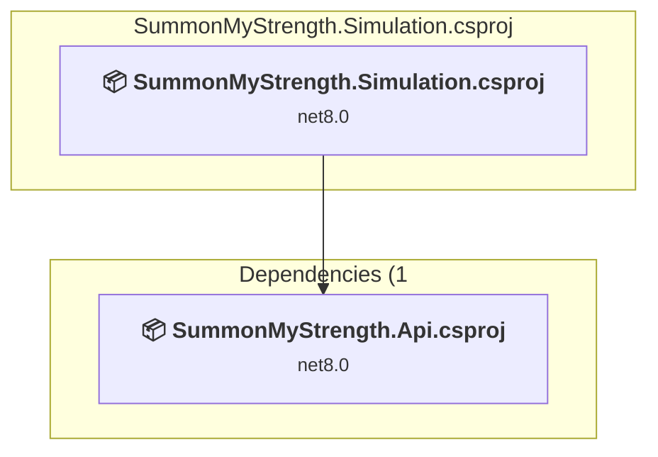

# Projects and dependencies analysis

This document provides a comprehensive overview of the projects and their dependencies in the context of upgrading to .NETCoreApp,Version=v10.0.

## Table of Contents

- [Executive Summary](#executive-Summary)
  - [Highlevel Metrics](#highlevel-metrics)
  - [Projects Compatibility](#projects-compatibility)
  - [Package Compatibility](#package-compatibility)
  - [API Compatibility](#api-compatibility)
- [Aggregate NuGet packages details](#aggregate-nuget-packages-details)
- [Top API Migration Challenges](#top-api-migration-challenges)
  - [Technologies and Features](#technologies-and-features)
  - [Most Frequent API Issues](#most-frequent-api-issues)
- [Projects Relationship Graph](#projects-relationship-graph)
- [Project Details](#project-details)

  - [SummonMyStrength.Api\SummonMyStrength.Api.csproj](#summonmystrengthapisummonmystrengthapicsproj)
  - [SummonMyStrength.Installer\SummonMyStrength.Installer.csproj](#summonmystrengthinstallersummonmystrengthinstallercsproj)
  - [SummonMyStrength.Maui\SummonMyStrength.Maui.csproj](#summonmystrengthmauisummonmystrengthmauicsproj)
  - [SummonMyStrength.Simulation\SummonMyStrength.Simulation.csproj](#summonmystrengthsimulationsummonmystrengthsimulationcsproj)

## Executive Summary

### Highlevel Metrics

| Metric | Count | Status |
| :--- | :---: | :--- |
| Total Projects | 4 | All require upgrade |
| Total NuGet Packages | 9 | 4 need upgrade |
| Total Code Files | 184 |  |
| Total Code Files with Incidents | 10 |  |
| Total Lines of Code | 5245 |  |
| Total Number of Issues | 37 |  |
| Estimated LOC to modify | 28+ | at least 0.5% of codebase |

### Projects Compatibility

| Project | Target Framework | Difficulty | Package Issues | API Issues | Est. LOC Impact | Description |
| :--- | :---: | :---: | :---: | :---: | :---: | :--- |
| [SummonMyStrength.Api\SummonMyStrength.Api.csproj](#summonmystrengthapisummonmystrengthapicsproj) | net8.0 | 🟢 Low | 4 | 26 | 26+ | ClassLibrary, Sdk Style = True |
| [SummonMyStrength.Installer\SummonMyStrength.Installer.csproj](#summonmystrengthinstallersummonmystrengthinstallercsproj) | net472 | 🟢 Low | 0 | 0 |  | WinForms, Sdk Style = True |
| [SummonMyStrength.Maui\SummonMyStrength.Maui.csproj](#summonmystrengthmauisummonmystrengthmauicsproj) | net8.0-android;net8.0-ios;net8.0-maccatalyst;net8.0-windows10.0.19041.0 | 🟢 Low | 1 | 2 | 2+ | DotNetCoreApp, Sdk Style = True |
| [SummonMyStrength.Simulation\SummonMyStrength.Simulation.csproj](#summonmystrengthsimulationsummonmystrengthsimulationcsproj) | net8.0 | 🟢 Low | 0 | 0 |  | ClassLibrary, Sdk Style = True |

### Package Compatibility

| Status | Count | Percentage |
| :--- | :---: | :---: |
| ✅ Compatible | 5 | 55.6% |
| ⚠️ Incompatible | 0 | 0.0% |
| 🔄 Upgrade Recommended | 4 | 44.4% |
| ***Total NuGet Packages*** | ***9*** | ***100%*** |

### API Compatibility

| Category | Count | Impact |
| :--- | :---: | :--- |
| 🔴 Binary Incompatible | 0 | High - Require code changes |
| 🟡 Source Incompatible | 10 | Medium - Needs re-compilation and potential conflicting API error fixing |
| 🔵 Behavioral change | 18 | Low - Behavioral changes that may require testing at runtime |
| ✅ Compatible | 5846 |  |
| ***Total APIs Analyzed*** | ***5874*** |  |

## Aggregate NuGet packages details

| Package | Current Version | Suggested Version | Projects | Description |
| :--- | :---: | :---: | :--- | :--- |
| Microsoft.AspNetCore.Components.WebView.Maui |  |  | [SummonMyStrength.Maui.csproj](#summonmystrengthmauisummonmystrengthmauicsproj) | ✅Compatible |
| Microsoft.Extensions.DependencyInjection.Abstractions | 8.0.0 | 10.0.5 | [SummonMyStrength.Api.csproj](#summonmystrengthapisummonmystrengthapicsproj) | NuGet package upgrade is recommended |
| Microsoft.Extensions.Http | 8.0.0 | 10.0.5 | [SummonMyStrength.Api.csproj](#summonmystrengthapisummonmystrengthapicsproj) | NuGet package upgrade is recommended |
| Microsoft.Extensions.Logging.Debug | 8.0.0 | 10.0.5 | [SummonMyStrength.Maui.csproj](#summonmystrengthmauisummonmystrengthmauicsproj) | NuGet package upgrade is recommended |
| Microsoft.Maui.Controls |  |  | [SummonMyStrength.Maui.csproj](#summonmystrengthmauisummonmystrengthmauicsproj) | ✅Compatible |
| Microsoft.Maui.Controls.Compatibility |  |  | [SummonMyStrength.Maui.csproj](#summonmystrengthmauisummonmystrengthmauicsproj) | ✅Compatible |
| MudBlazor | 6.12.0 |  | [SummonMyStrength.Maui.csproj](#summonmystrengthmauisummonmystrengthmauicsproj) | ✅Compatible |
| System.Management | 5.0.0 | 10.0.5 | [SummonMyStrength.Api.csproj](#summonmystrengthapisummonmystrengthapicsproj) | NuGet package upgrade is recommended |
| WixSharp_wix4 | 2.4.2 |  | [SummonMyStrength.Installer.csproj](#summonmystrengthinstallersummonmystrengthinstallercsproj) | ✅Compatible |

## Top API Migration Challenges

### Technologies and Features

| Technology | Issues | Percentage | Migration Path |
| :--- | :---: | :---: | :--- |
| System Management (WMI) | 6 | 21.4% | Windows Management Instrumentation (WMI) APIs for system administration and monitoring that are available via NuGet package System.Management. These APIs provide access to Windows system information but are Windows-only; consider cross-platform alternatives for new code. |

### Most Frequent API Issues

| API | Count | Percentage | Category |
| :--- | :---: | :---: | :--- |
| T:System.Net.Http.HttpContent | 6 | 21.4% | Behavioral Change |
| T:System.Uri | 5 | 17.9% | Behavioral Change |
| M:System.Uri.#ctor(System.String) | 3 | 10.7% | Behavioral Change |
| M:Microsoft.Extensions.DependencyInjection.HttpClientFactoryServiceCollectionExtensions.AddHttpClient(Microsoft.Extensions.DependencyInjection.IServiceCollection,System.String) | 2 | 7.1% | Behavioral Change |
| M:System.TimeSpan.FromSeconds(System.Double) | 2 | 7.1% | Source Incompatible |
| F:System.Security.Authentication.SslProtocols.Tls | 1 | 3.6% | Source Incompatible |
| F:System.Security.Authentication.SslProtocols.Tls11 | 1 | 3.6% | Source Incompatible |
| P:System.Uri.AbsoluteUri | 1 | 3.6% | Behavioral Change |
| M:System.Text.Json.JsonSerializer.Deserialize(System.Text.Json.JsonElement,System.Type,System.Text.Json.JsonSerializerOptions) | 1 | 3.6% | Behavioral Change |
| T:System.Management.ManagementObject | 1 | 3.6% | Source Incompatible |
| P:System.Management.ManagementBaseObject.Item(System.String) | 1 | 3.6% | Source Incompatible |
| T:System.Management.ManagementObjectCollection | 1 | 3.6% | Source Incompatible |
| M:System.Management.ManagementObjectSearcher.Get | 1 | 3.6% | Source Incompatible |
| T:System.Management.ManagementObjectSearcher | 1 | 3.6% | Source Incompatible |
| M:System.Management.ManagementObjectSearcher.#ctor(System.String) | 1 | 3.6% | Source Incompatible |

## Projects Relationship Graph

Legend:
📦 SDK-style project
⚙️ Classic project

## Project Details

### SummonMyStrength.Api\SummonMyStrength.Api.csproj

#### Project Info

- **Current Target Framework:** net8.0
- **Proposed Target Framework:** net10.0
- **SDK-style**: True
- **Project Kind:** ClassLibrary
- **Dependencies**: 0
- **Dependants**: 2
- **Number of Files**: 104
- **Number of Files with Incidents**: 6
- **Lines of Code**: 2856
- **Estimated LOC to modify**: 26+ (at least 0.9% of the project)

#### Dependency Graph

Legend:
📦 SDK-style project
⚙️ Classic project

### API Compatibility

| Category | Count | Impact |
| :--- | :---: | :--- |
| 🔴 Binary Incompatible | 0 | High - Require code changes |
| 🟡 Source Incompatible | 8 | Medium - Needs re-compilation and potential conflicting API error fixing |
| 🔵 Behavioral change | 18 | Low - Behavioral changes that may require testing at runtime |
| ✅ Compatible | 2889 |  |
| ***Total APIs Analyzed*** | ***2915*** |  |

#### Project Technologies and Features

| Technology | Issues | Percentage | Migration Path |
| :--- | :---: | :---: | :--- |
| System Management (WMI) | 6 | 23.1% | Windows Management Instrumentation (WMI) APIs for system administration and monitoring that are available via NuGet package System.Management. These APIs provide access to Windows system information but are Windows-only; consider cross-platform alternatives for new code. |

### SummonMyStrength.Installer\SummonMyStrength.Installer.csproj

#### Project Info

- **Current Target Framework:** net472
- **Proposed Target Framework:** net10.0-windows
- **SDK-style**: True
- **Project Kind:** WinForms
- **Dependencies**: 0
- **Dependants**: 0
- **Number of Files**: 1
- **Number of Files with Incidents**: 1
- **Lines of Code**: 45
- **Estimated LOC to modify**: 0+ (at least 0.0% of the project)

#### Dependency Graph

Legend:
📦 SDK-style project
⚙️ Classic project

### API Compatibility

| Category | Count | Impact |
| :--- | :---: | :--- |
| 🔴 Binary Incompatible | 0 | High - Require code changes |
| 🟡 Source Incompatible | 0 | Medium - Needs re-compilation and potential conflicting API error fixing |
| 🔵 Behavioral change | 0 | Low - Behavioral changes that may require testing at runtime |
| ✅ Compatible | 72 |  |
| ***Total APIs Analyzed*** | ***72*** |  |

### SummonMyStrength.Maui\SummonMyStrength.Maui.csproj

#### Project Info

- **Current Target Framework:** net8.0-android;net8.0-ios;net8.0-maccatalyst;net8.0-windows10.0.19041.0
- **Proposed Target Framework:** net8.0-android;net8.0-ios;net8.0-maccatalyst;net8.0-windows10.0.19041.0;net10.0-windows
- **SDK-style**: True
- **Project Kind:** DotNetCoreApp
- **Dependencies**: 1
- **Dependants**: 0
- **Number of Files**: 135
- **Number of Files with Incidents**: 2
- **Lines of Code**: 2072
- **Estimated LOC to modify**: 2+ (at least 0.1% of the project)

#### Dependency Graph

Legend:
📦 SDK-style project
⚙️ Classic project

### API Compatibility

| Category | Count | Impact |
| :--- | :---: | :--- |
| 🔴 Binary Incompatible | 0 | High - Require code changes |
| 🟡 Source Incompatible | 2 | Medium - Needs re-compilation and potential conflicting API error fixing |
| 🔵 Behavioral change | 0 | Low - Behavioral changes that may require testing at runtime |
| ✅ Compatible | 2714 |  |
| ***Total APIs Analyzed*** | ***2716*** |  |

### SummonMyStrength.Simulation\SummonMyStrength.Simulation.csproj

#### Project Info

- **Current Target Framework:** net8.0
- **Proposed Target Framework:** net10.0
- **SDK-style**: True
- **Project Kind:** ClassLibrary
- **Dependencies**: 1
- **Dependants**: 0
- **Number of Files**: 18
- **Number of Files with Incidents**: 1
- **Lines of Code**: 272
- **Estimated LOC to modify**: 0+ (at least 0.0% of the project)

#### Dependency Graph

Legend:
📦 SDK-style project
⚙️ Classic project

### API Compatibility

| Category | Count | Impact |
| :--- | :---: | :--- |
| 🔴 Binary Incompatible | 0 | High - Require code changes |
| 🟡 Source Incompatible | 0 | Medium - Needs re-compilation and potential conflicting API error fixing |
| 🔵 Behavioral change | 0 | Low - Behavioral changes that may require testing at runtime |
| ✅ Compatible | 171 |  |
| ***Total APIs Analyzed*** | ***171*** |  |

