# Summon My Strength

## What is it?

This is a lightweight windows app that uses the local League of Legends Client API to add some significant quality of life improvements to the pre and post game.

## Prerequisites

Try running the app without installing these as you may already have them or they may not be required (prerequisites list is based on old posts that may be out of date).

* [WinAppSdk](https://docs.microsoft.com/windows/apps/windows-app-sdk/downloads)

## Features

### Pre-Game

#### Accept Ready Check

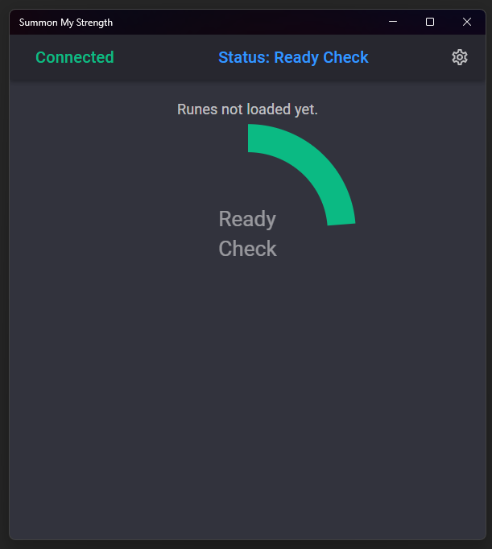

If enabled in the settings, Summon My Strength will automatically accept ready checks after 2.5 seconds. That
gives you just enough time to decline the ready check if you want while not wasting any time.

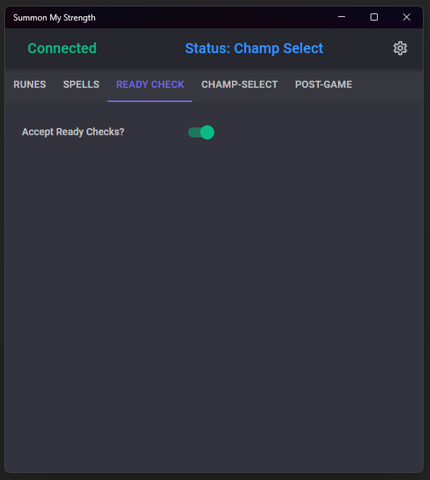

#### Per-Champion Runes

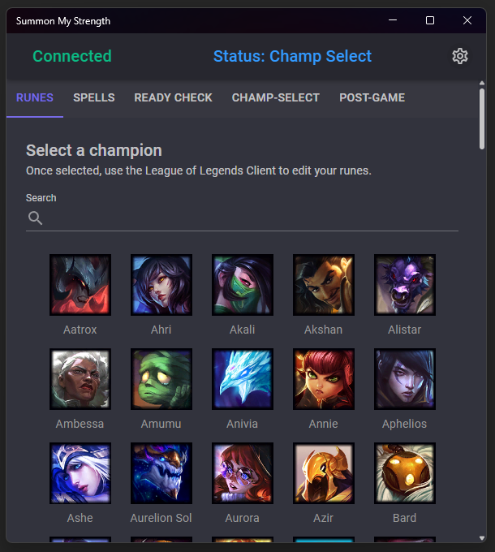

Your rune pages will be saved and loaded based on your currently selected champion. When you hover or lock in a
champion in Champ Select, their runes will be loaded in. When you change rune pages, the changes will be saved
here too! You can also go to the settings page to pick which champion you want to load/edit runes for.

Rune pages starting with "QP " are not changed/deleted when using this app. This is to allow you to have quickplay
rune pages that don't get unloaded when changing your selected champion.

#### Per-Champion Spells

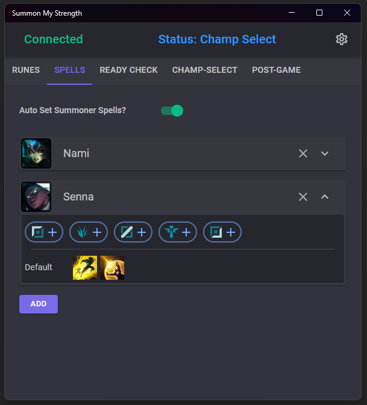

Set which spells you want to use for each champion in each position and Summon My Strength will automatically
update your summoner spells in Champ Select to match.

#### Automatic Picking and Banning

What's better than spending 10 minutes on queue and then champ select? Not doing that.

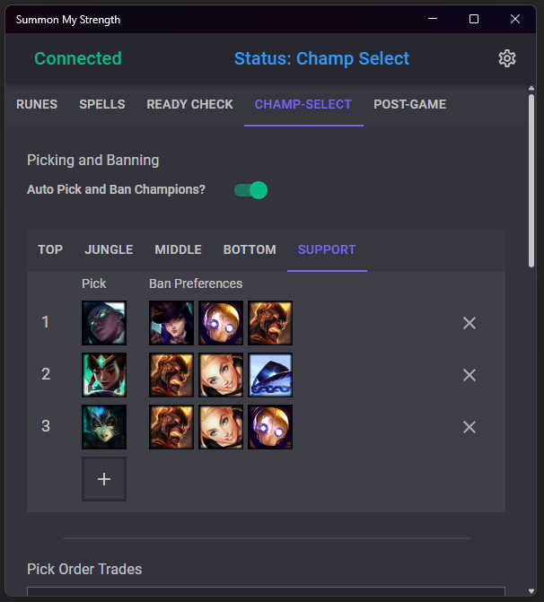

With Summon My Strength, you can configure which champions you prefer to play and which
champions you want to ban for each one and let the app do the rest! It'll automatically
hover the champion you want to go when you join Champ Select, automatically hover your
preferred ban for 5 seconds and when it's time to lock your champion in, it'll do that
too. Your pick got banned? The app will automatically switch to the next pick on the
list.

Someone asked you to swap positions with them? Just select your new position in Summon My Strength and your
picks and bans will be automatically adjusted straight away.

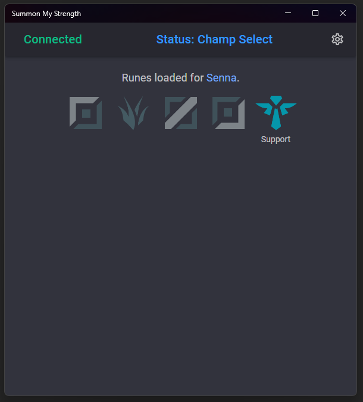

#### Pick Order Trade Handling

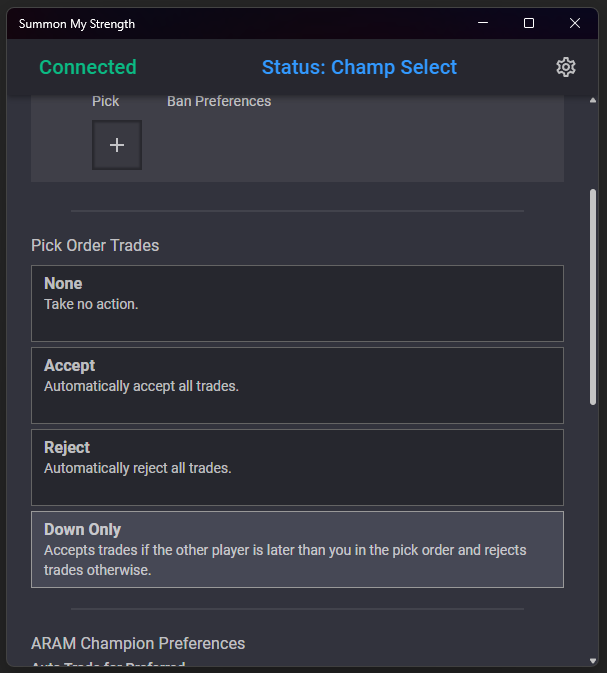

Tired of constant pick order trade requests? Now you can have the app handle them for you automatically.
Reject all? Accept all? or just the ones that give you an advantage?

#### ARAM Auto Trading

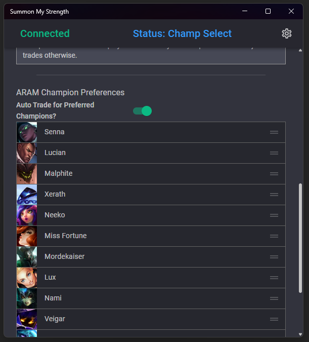

Set which champions you prefer to play in ARAM and have Summon My Strength automatically
swap with the bench and initiate trades with other players to get you your most preferred
champion pick. The app will _not_ reroll for you so your rerolls are safe!

### Post-Game

#### Automatic Player Honoring

Lets be honest, honoring up to 4 players each match is a bit tedious. Why not skip it?

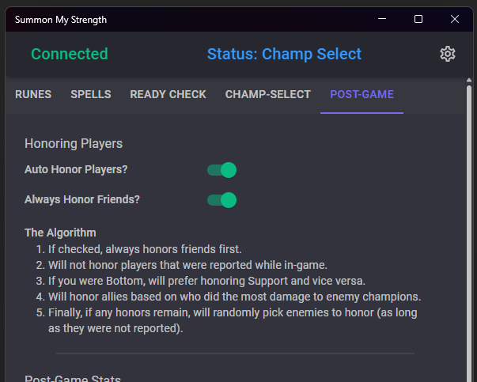

#### Built-In Post-Game Stats

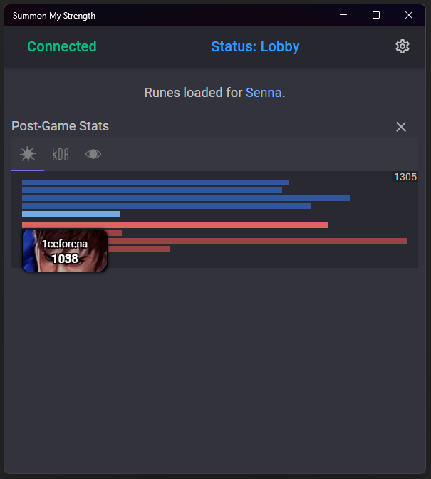

The post-game stats screen in the League Client has a lot going on. In Summon My Strength,
you can specify which stat graphs you want to see and even skip the stats screen in the
League Client altogether. Combined with automatic honoring, you can queue up for your next
game seconds after the last one ended.

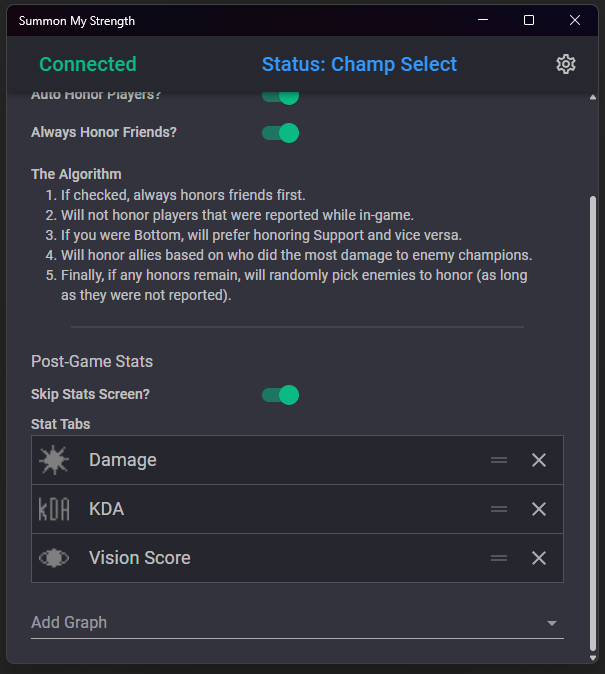

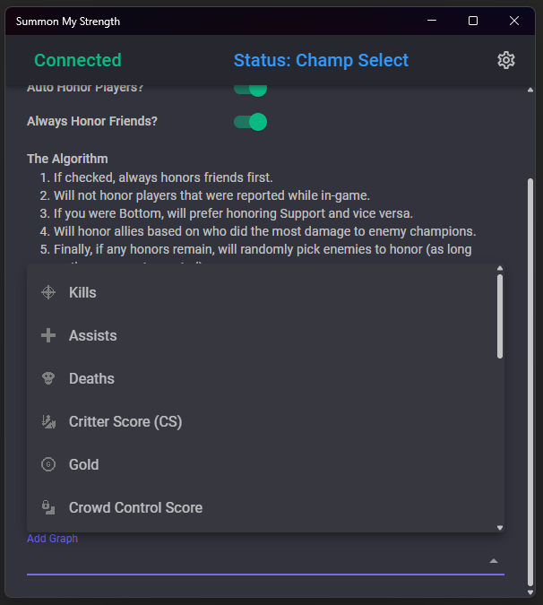

## Settings

Settings are stored in My Documents (or equivalent) under `My Games\Summon My Strength`.

```
C:\Users\USERNAME\Documents\My Games\Summon My Strength
C:\Users\USERNAME\OneDrive\Documents\My Games\Summon My Strength
```